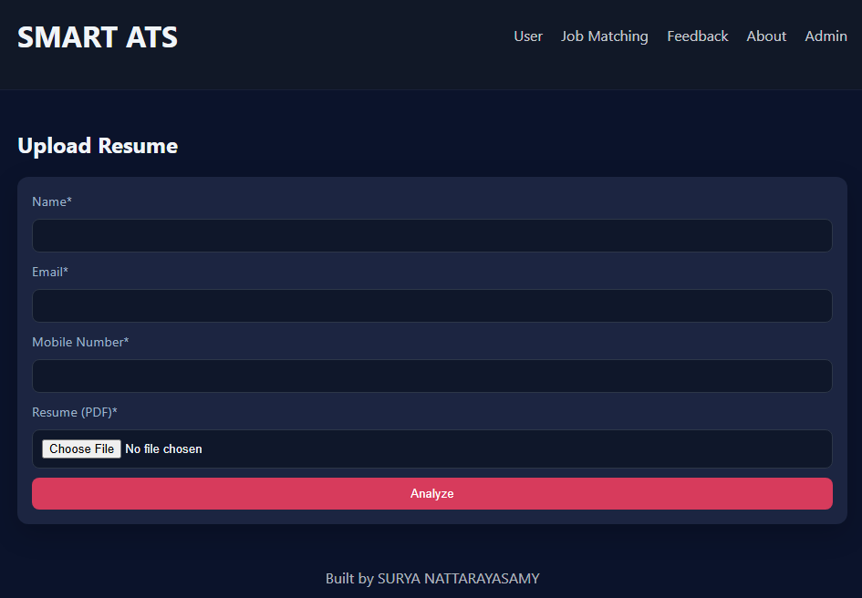
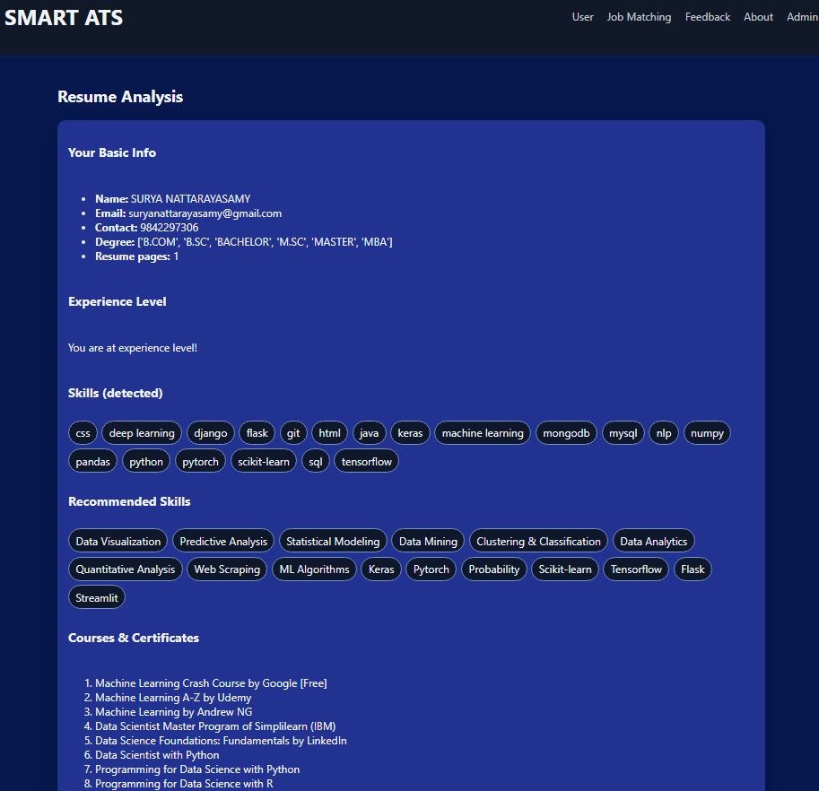
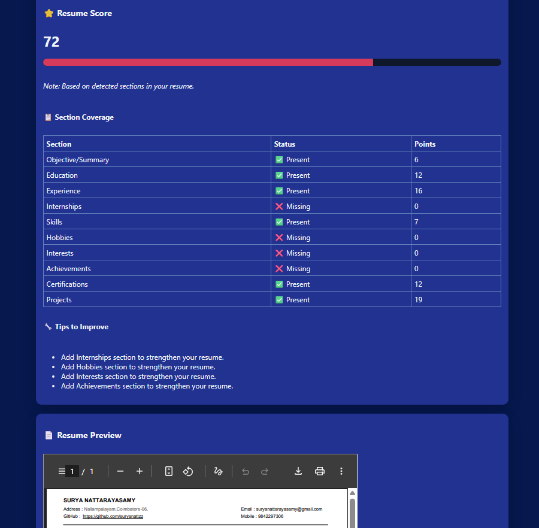
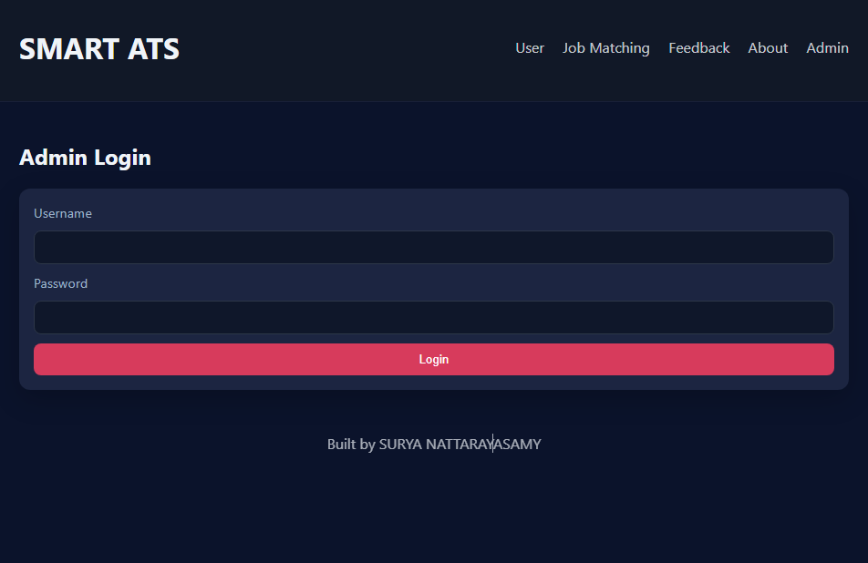
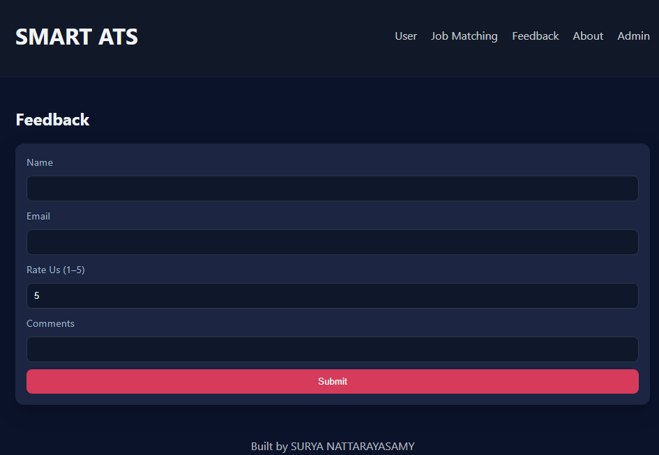

# 📌 Applicant Tracking System (ATS)


A Smart **Applicant Tracking System** (ATS) built using **Python, Flask, SpaCy, and MySQL**.
It helps HRs & recruiters analyze resumes, extract key details, and shortlist candidates efficiently — saving time and effort in the hiring process.

---

## ⚡ Features

* 📝 Resume Upload & Parsing
* 📊 NLP-powered Text Extraction (using SpaCy)
* 🗄️ MySQL Database Integration
* 🔐 Admin Login for ATS Dashboard
* 📂 Organized Resume Storage
* 🔒 Secure Config using `.env`

---

## 🛠️ Requirements

* Python **3.10**
* MySQL (running locally or on a server)
* Virtual Environment (`venv`)
* pip (Python package manager)

---

## 🚀 Setup Instructions

### 1. Clone the Repository

```bash
git clone https://github.com/suryanattzz/Apllicant_Tracking_System_ATS.git
cd Apllicant_Tracking_System_ATS
```

### 2. Create a Virtual Environment

```bash
python -m venv yourenv
```

Activate it:

* **Windows (CMD/PowerShell):**

```bash
yourenv\Scripts\activate
```

* **Linux/Mac:**

```bash
source yourenv/bin/activate
```

### 3. Install Dependencies

```bash
pip install -r requirements.txt
```

If not available, install key packages manually:

```bash
pip install flask spacy mysql-connector-python python-dotenv
python -m spacy download en_core_web_trf
```

### 4. Configure Environment Variables

Create a `.env` file in the project root:

```ini
# Database Configuration
DB_HOST=localhost
DB_USER=root
DB_PASS=root
DB_NAME=cv

# Flask Secret Key
FLASK_SECRET=F!9j@83klp$1qZ_az7Nv2Xy&3L0bH^

# File Uploads
UPLOAD_FOLDER=Uploaded_Resumes

# Admin Login
ADMIN_USER=admin
ADMIN_PASS=admin@ats
```

⚠️ `.env` is in `.gitignore` — it won’t be uploaded to GitHub.

### 5. Set Up MySQL Database

```bash
mysql -u root -p
```

```sql
CREATE DATABASE cv;
```

(If you have a `db.sql` file in the repo, import it)

```bash
mysql -u root -p cv < db.sql
```

### 6. Run the Application

```bash
python app.py
```

The app will be available at:
👉 [http://127.0.0.1:5000](http://127.0.0.1:5000)

### 7. Deactivate Environment (when done)

```bash
deactivate
```

---

## 🔐 Security Notes

* Change `FLASK_SECRET`, `DB_PASS`, and `ADMIN_PASS` before deployment.
* Use **GitHub Secrets** or **Docker ENV variables** in production.

---

## 📌 Folder Structure (Example)

```
Apllicant-Tracking-System-/
│── app.py
│── config.py
│── db.py
│── requirements.txt
│── Uploaded_Resumes/
│── templates/
│── static/
│── screenshots/
│── .env   (ignored)
│── .gitignore
│── README.md
```

---

## ⚙️ Tech Stack

* Python 3.11
* Flask
* SpaCy (NLP)
* MySQL
* HTML/CSS/Bootstrap (Frontend)

---

## 🎯 Use Cases

* HR teams can manage resumes
* Auto-screening candidates
* Resume storage & retrieval

---

## 📊 Workflow / How It Works

Step 1 → Upload Resume
Step 2 → Resume parsed with SpaCy
Step 3 → Data stored in MySQL
Step 4 → Admin reviews candidates


---

## 🚀 Future Enhancements

* AI-powered candidate ranking
* Email notification system
* Job posting integration

---

## 📸 Screenshots

### 🏠 Home Page




### 📂 Resume Upload





### 🔑 Admin Login




### 📊 Feedback



---

## 🤝 Contribution

Contributions are welcome!

1. Fork the repo
2. Create a new branch (`feature-xyz`)
3. Commit changes
4. Submit a Pull Request

---

---

## 👨‍💻 Author

**Surya Nattzz**
🔗 [GitHub](https://github.com/suryanattzz)

---
